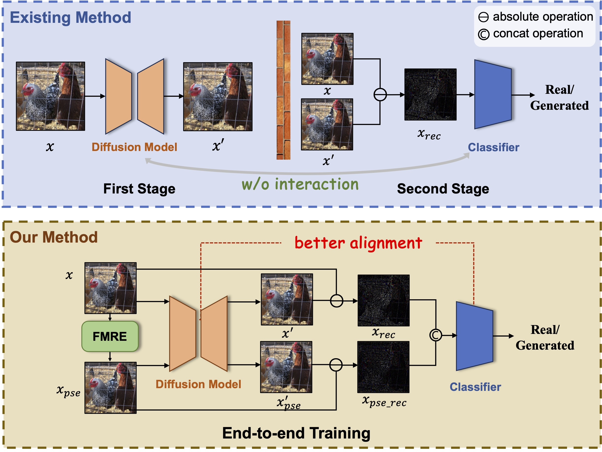

<h1 align="center">🔥 FIRE: Robust Detection of Diffusion-Generated Images via Frequency-Guided
Reconstruction Error </h1>
<p align="center">
    <a href="https://arxiv.org/abs/2412.07140v2">
        
    </a>
    <a href="https://github.com/mengyougithub/FinBERT2-Suits/blob/master/LICENSE">
        
    </a>

<h4 align="center">
    <p>
        <a href="#Project Overview">Project Overview</a> |
        <a href="#Reproduction Steps">Reproduction Steps</a> |
        <a href=#Acknowledgments>Acknowledgments</a> |
        <a href="#citation">Citation</a> |
        <a href="#license">License</a> 
    <p>
</h4>

<p align="center">

</p>

#### 🎊 Accepted by CVPR 2025.
- [x] ~[2025/05/01] Fix bugs and update codes.~
- [x] ~[2025/05/01] Release pre-trained models and pre-processed dataset.~
- [x] ~[2025/02/27] Release code.~
- [x] ~[2024/12/10] Release paper.~


## <a id="Project Overview"></a>Project Overview

#### `ckpt/`

- Stores checkpoints of models.

#### `data/`

- DiffusionForensics and self-collected dataset.

#### `utils/`

- Helper functions for data preprocessing, metrics, and model initialization.
    - `augment.py`: Includes weak and strong augmentation strategies.
    - `metrics.py`: Metrics to evaluate performance.
    - `network_utils.py`: Initializes FIRE.

#### `dataset.py`

- Loads datasets.

#### `train.py`

- Trains the FIRE model.

#### `eval.py`

- Tests the FIRE model.

#### `misc/dataset_construct.py`
- Dataset preprocessing script for reference (including intermediate images used for comparison with other methods). The processed files can be found in the `Data Preparation` section below.

## <a id="Reproduction Steps"></a>Reproduction Steps
### 1. Data preparation

Downloads [DiffusionForensics](https://github.com/ZhendongWang6/DIRE) [DIRE, ICCV 2023] or self-collected dataset and put them in `data/`. 
You can download our pre-processed version from urls below:

- [DiffusionForensics-imagenet-train](https://drive.google.com/file/d/15vNTwv1S_tQEKu-iNTDfHYj3xCxCmBuD/view?usp=sharing_link)
- [DiffusionForensics-imagenet-test](https://drive.google.com/file/d/1jvsERmw-XYWnv6mUdHRVg0odEQ3zUN-A/view?usp=share_link)
- [DiffusionForensics-lsun_bedroom-train](https://drive.google.com/file/d/1YgkUR9Ay3J0of8z29onVZm_2eNb8wD8A/view?usp=share_link)
- [DiffusionForensics-lsun_bedroom-test](https://drive.google.com/file/d/1V6XXi-LzF548T7ctFWd0R61Rng7H8lSP/view?usp=share_link)

Then organize datasets as follows:

```bash
data/DiffusionForensics/
└── train/test
    ├── imagenet
    │   ├── real
    │   │   └──img0.png...
    │   ├── adm
    │   │   └──img0.png...
    │   ├── ...
    └── lsun_bedroom
        ├── real
        │   └──img0.png...
        ├── adm
        │   └──img0.png...
        ├── ...

(optional)
data/fake-inversion/
└── train/test
    ├──  dalle3
    │    ├── 0_real
    │    │   └──img0.png...
    │    └── 1_fake
    │        └──img0.png...
    ├── kandinsky3
    │    ├── 0_real
    │    │   └──img0.png...
    │    └── 1_fake
    │        └──img0.png...
    ├──  midjourney
    │    ...
    ├──  sdxl
    │    ...
    └──  vega
         ...
```

### 2. Setup

```bash
pip install -r requirements.txt
```

### 3. **Training**
We release our pre-trained checkoutpoints (Table 1. in paper) here:
- [Imagenet with adm](https://drive.google.com/file/d/1bTVrfyUNcjOKFiP1HlvyE9xNqWLhJrGq/view?usp=sharing)
- [Lsun_bedroom with adm](https://drive.google.com/file/d/1cbaoRMJH9y-reOesTygSvuAU7uz6dNGm/view?usp=sharing)

#### 🖥️ Model Training Time (for Reference)
> **⚙️ Hardware**
> - **GPU**: Nvidia A100-40G * 1
> 
> **🔧 Training Parameters**
> - **Default values** in the code.
> 
> **⏱️ Training Speed**
> - **~45 minutes** per epoch.
> 
> **🎯 Optimal Weights**
> - Typically found **~20th epoch**.

If you want to train the FIRE model from scratch, please run:

```bash
# train on DiffusionForensics
./train_df.sh

# train on self-collected dataset
./train_fi.sh
```

### 4. **Evaluation**

To evaluate the FIRE model, please run:

```bash
# test on DiffusionForensics
./test_df.sh
# test on self-collected dataset
./test_fi.sh
```

## <a id="Acknowledgments"></a>Acknowledgments
Our code is developed based on [DIRE](https://github.com/ZhendongWang6/DIRE) and [FakeInversion](https://fake-inversion.github.io). We appreciate their shared codes and datasets.

## <a id="Citation"></a>Citation

If you find our work helpful, please consider citing the following paper:
```
@article{chu2024fire,
  title={FIRE: Robust Detection of Diffusion-Generated Images via Frequency-Guided Reconstruction Error},
  author={Chu, Beilin and Xu, Xuan and Wang, Xin and Zhang, Yufei and You, Weike and Zhou, Linna},
  journal={arXiv preprint arXiv:2412.07140},
  year={2024}
}
```
## <a id="License"></a>License
Based on the [MIT](LICENSE) open source license.
