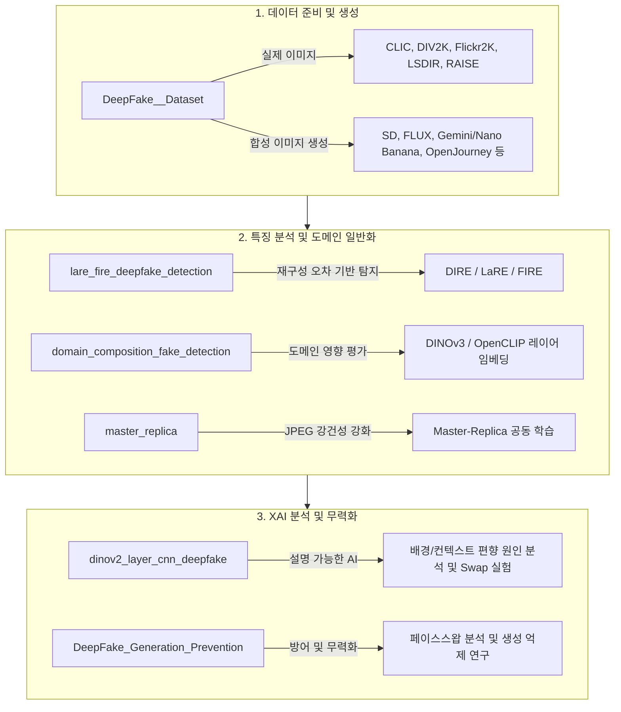

# DeepFake Image Detection & Prevention Research Index

본 저장소는 딥페이크 이미지 탐지(Detection), 생성(Generation), 그리고 예방/무력화(Prevention)와 관련된 개별 프로젝트 저장소들을 체계적으로 연결하고 정리한 **중앙 인덱스 저장소**입니다.

각 프로젝트는 독립된 저장소로 관리되어 코드, 실험 결과, 개별 매뉴얼을 독립적으로 확인할 수 있습니다.

---

## 📂 저장소 및 디렉터리 매핑 (Repository & Directory Mapping)

로컬 작업 공간의 디렉터리 구조와 GitHub에 업로드된 개별 Public 저장소의 연결 관계는 다음과 같습니다.

| 로컬 디렉터리 명 (Local Directory) | 연계 GitHub 저장소 (GitHub Repository) | 설명 (Description) |
| :--- | :--- | :--- |
| **`Reconstruction_Error`** | [lare_fire_deepfake_detection](https://github.com/Fate-0527/lare_fire_deepfake_detection.git) | LaRE/FIRE 기법, DIRE(재구성 오차), 커스텀 탐지 모델(Mymodel), 타임스텝 실험(T_Step) 등 메인 탐지 연구 공간 |
| **`Master-Replica`** | [master_replica](https://github.com/Fate-0527/master_replica.git) | JPEG 압축에 강건한 탐지기 학습을 위한 Master(원본 PNG)-Replica(압축 JPEG) 공동 학습 프레임워크 |
| **`domain_composition`** | [domain_composition_fake_detection](https://github.com/Fate-0527/domain_composition_fake_detection.git) | 학습 데이터의 도메인 구성이 미지의 가짜 이미지 탐지기 일반화에 미치는 영향 분석 (DINOv3/OpenCLIP 백본 활용) |
| **`DeepFake_Dataset`** | [DeepFake__Dataset](https://github.com/Fate-0527/DeepFake__Dataset.git) | COCO 캡션 기반 다중 생성기 합성 이미지 파이프라인(Make Image) 및 실제 고화질 데이터셋 자동 다운로드 스크립트 |
| **`vit_layer_cnn_deepfake`** | [dinov2_layer_cnn_deepfake](https://github.com/Fate-0527/dinov2_layer_cnn_deepfake) | DINOv2 ViT 레이어 특징 추출 및 XAI(설명 가능한 AI) 기반 배경/전경 편향 분석 및 검증 연구 |
| **`DeepFake_Generation_Prevention`** | *(로컬 전용 - Local Only)* | 페이스 스왑 생성기(DiffSwap, SimSwap, facefusion, InstantID) 및 생성 제어/예방 메커니즘 도구 모음 |

---

## 🔍 프로젝트별 세부 소개 (Project Details)

### 1. LaRE + FIRE Deepfake Detection (`Reconstruction_Error`)
* **GitHub Repository:** [lare_fire_deepfake_detection](https://github.com/Fate-0527/lare_fire_deepfake_detection.git)
* **주요 구성 요소:**
  * `Mymodel/`: 커스텀 탐지 모델 설계 및 주파수 분석(Radial Profile, GLCM, Local Variance 등) 실험 코드.
  * `DIRE/` (Diffusion Reconstruction Error): 디퓨전 모델의 재구성 오차 기반 생성 이미지 탐지 코드.
  * `LaRE/` (Language-guided Reconstruction Error): 텍스트 가이드를 결합한 이미지 재구성 오차 기반 탐지 기법.
  * `FIRE/`: 딥페이크 탐지용 모델 학습 및 검증 스크립트.
  * `T_Step/`: DIRE 탐지 성능을 최적화하기 위한 디퓨전 타임스텝($T$) 분석 실험.

### 2. Master-Replica Compression-Aware Training (`Master-Replica`)
* **GitHub Repository:** [master_replica](https://github.com/Fate-0527/master_replica.git)
* **주요 구성 요소:**
  * JPEG 압축 이미지에 대해 탐지 정확도가 급락하는 문제를 해결하기 위해, 학습 중 동일 이미지의 원본(Master)과 다양한 품질(Q30~Q100)로 압축된 이미지(Replica)를 동시에 학습시키는 프레임워크.
  * `models.py`: 6종의 탐지 백본 모델(ResNet-50, EfficientNet-B4, ViT-Base, Xception, MesoNet-4, F3-Net) 지원.
  * `evaluate_zeroshot.py`: 학습에 사용되지 않은 가짜 이미지 도메인에 대한 제로샷 일반화 성능 평가.

### 3. Domain Composition Evaluation (`domain_composition`)
* **GitHub Repository:** [domain_composition_fake_detection](https://github.com/Fate-0527/domain_composition_fake_detection.git)
* **주요 구성 요소:**
  * 학습 데이터의 다양성(Real/Fake 조합 설정인 Meta 1~4)이 미지의 도메인 일반화에 미치는 영향을 체계적으로 비교 분석하는 파이프라인.
  * `extract_embeddings_meta*.py`: DINOv3 및 OpenCLIP 특징 백본을 활용한 레이어별(8~15 레이어) 임베딩 추출 및 t-SNE 시각화.
  * `unseen_classifier_all_meta_dino_v2_fixed.py`: 추출된 임베딩을 기반으로 9종의 분류기(SVM, XGBoost, LightGBM 등) 성능 평가 및 의사결정 경계(Decision Map) 시각화.

### 4. DeepFake Dataset & Generation (`DeepFake_Dataset`)
* **GitHub Repository:** [DeepFake__Dataset](https://github.com/Fate-0527/DeepFake__Dataset.git)
* **주요 구성 요소:**
  * `Real_Data_Download/`: CLIC, DIV2K, Flickr2K, LSDIR, RAISE 등의 고화질 실제 데이터셋 자동 다운로드 도구.
  * `stable_diffusion_*.py`, `flux_*.py`, `openjourney.py`, `imagen.py`, `veo.py`, `cogvideo.py`, `run_nano_banana.py`: COCO 캡션을 기반으로 다양한 생성형 AI 모델을 호출하여 대량의 가짜 이미지 데이터셋을 생성하는 멀티 모델 생성 파이프라인.

### 5. DINOv2 Layer-CNN & XAI Analysis (`vit_layer_cnn_deepfake`)
* **GitHub Repository:** [dinov2_layer_cnn_deepfake](https://github.com/Fate-0527/dinov2_layer_cnn_deepfake)
* **주요 구성 요소:**
  * DINOv2 ViT-L/14 레이어 특징을 기반으로 학습된 경량 CNN 분류기의 의사결정 원인을 설명 가능한 AI(XAI) 및 CAM 기법으로 분석.
  * **주요 발견:** 모델이 객체(Object) 자체보다 원경 배경(Far-Background) 및 글로벌 컨텍스트(Global Context)에 크게 의존하여 판별하는 편향(Bias)이 존재함을 발견하고, 배경 스왑(Background Swap) 실험을 통해 인과적으로 증명.

### 6. DeepFake Generation & Prevention (`DeepFake_Generation_Prevention`)
* **로컬 전용 (Local Only)**
* **주요 구성 요소:**
  * `Prevention/`: ComfyUI, DiffFace, DiffSwap, facefusion, InstantID, SimSwap 등 오픈소스 기반 페이스 스왑 모델 구축 및 이들을 무력화하거나 예방하기 위한 연구 자료 모음.
  * `GAN/`: StarGAN, HyperStyle 등 GAN 기반 조작 도구들 포함.

---

## 🛠️ 연구 구성 및 흐름 (Research Workflow)

---

> ⚠️ **주의사항 (Git Policy)**:
> 1. 용량이 큰 원본 이미지 데이터셋, 모델 학습 체크포인트(`.pth`, `.pt`), 로컬 가상환경 및 API 비밀 키 등은 보안 및 저장소 최적화를 위해 `.gitignore`에 등록되어 있으며, 모든 Public 저장소 업로드 시 자동으로 제외됩니다.
> 2. `DeepFake_Generation_Prevention` 폴더는 페이스 스왑 라이브러리의 용량 및 라이선스 등으로 인해 로컬 전용으로 구성되어 있습니다.
