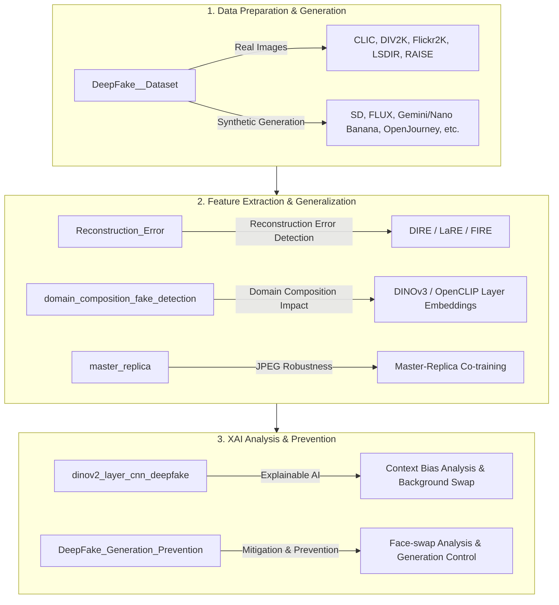

# DeepFake Image Detection & Prevention Research Index

This repository serves as a **Central Index Repository** that systematically connects and organizes individual project repositories related to DeepFake image detection, generation, and prevention/mitigation.

Each project is managed as an independent repository, allowing you to examine the source code, experimental results, and individual manuals separately.

---

## 📂 Repository & Directory Mapping

The mapping between the local directory layout and the public GitHub repositories is as follows:

| Local Directory | GitHub Repository | Description |
| :--- | :--- | :--- |
| **`Reconstruction_Error`** | [Reconstruction_Error](https://github.com/Fate-0527/Reconstruction_Error.git) | Main detection research space containing LaRE/FIRE methods, DIRE (Diffusion Reconstruction Error), custom detection model (Mymodel), and timestep experiments. |
| **`Master-Replica`** | [master_replica](https://github.com/Fate-0527/master_replica.git) | A co-training framework using Master (lossless PNG) and Replica (compressed JPEG) images to train detectors robust against JPEG compression artifacts. |
| **`domain_composition`** | [domain_composition_fake_detection](https://github.com/Fate-0527/domain_composition_fake_detection.git) | Analysis of how training data domain composition affects detector generalization on unseen fake image generators (utilizing DINOv3 and OpenCLIP backbones). |
| **`DeepFake_Dataset`** | [DeepFake__Dataset](https://github.com/Fate-0527/DeepFake__Dataset.git) | COCO caption-based synthetic image generation pipelines (Make Image) and automatic download utilities for high-resolution real datasets. |
| **`vit_layer_cnn_deepfake`** | [dinov2_layer_cnn_deepfake](https://github.com/Fate-0527/dinov2_layer_cnn_deepfake) | DINOv2 ViT layer feature extraction and Explainable AI (XAI) verification analyzing background/foreground bias in deepfake detectors. |
| **`DeepFake_Generation_Prevention`** | *(Local Only)* | A collection of face-swap generation frameworks (DiffSwap, SimSwap, facefusion, InstantID) and generation prevention/control mechanisms. |

---

## 🔍 Project Details

### 1. LaRE + FIRE Deepfake Detection (`Reconstruction_Error`)
* **GitHub Repository:** [Reconstruction_Error](https://github.com/Fate-0527/Reconstruction_Error.git)
* **Key Components:**
  * `Mymodel/`: Custom detection model architecture and frequency analysis experiments (Radial Profile, GLCM, Local Variance, etc.).
  * `DIRE/` (Diffusion Reconstruction Error): Detection code based on diffusion reconstruction error map.
  * `LaRE/` (Language-guided Reconstruction Error): Detection framework combining textual/language guides with reconstruction errors.
  * `FIRE/`: Training and validation scripts for deepfake detectors.
  * `T_Step/`: Experimental search and visualization of optimal timesteps ($T$) for DIRE.

### 2. Master-Replica Compression-Aware Training (`Master-Replica`)
* **GitHub Repository:** [master_replica](https://github.com/Fate-0527/master_replica.git)
* **Key Components:**
  * Training framework designed to prevent accuracy drops on compressed images in the wild by co-training lossless PNGs (Master) and random-quality JPEGs (Replica).
  * `models.py`: Supports 6 backbone detectors (ResNet-50, EfficientNet-B4, ViT-Base, Xception, MesoNet-4, F3-Net).
  * `evaluate_zeroshot.py`: Evaluates zero-shot generalization capability on unseen fake image generators.

### 3. Domain Composition Evaluation (`domain_composition`)
* **GitHub Repository:** [domain_composition_fake_detection](https://github.com/Fate-0527/domain_composition_fake_detection.git)
* **Key Components:**
  * A pipeline to systematically analyze how domain diversity in training data (Metas 1-4) impacts unseen domain generalization.
  * `extract_embeddings_meta*.py`: Layer-wise (layers 8–15) embedding extraction using DINOv3 and OpenCLIP backbones, with t-SNE visualization.
  * `unseen_classifier_all_meta_dino_v2_fixed.py`: Classifier evaluations (9 classifiers including SVM, LightGBM, XGBoost) and decision boundary maps visualization.

### 4. DeepFake Dataset & Generation (`DeepFake_Dataset`)
* **GitHub Repository:** [DeepFake__Dataset](https://github.com/Fate-0527/DeepFake__Dataset.git)
* **Key Components:**
  * `Real_Data_Download/`: Scripts for automatic downloading of high-resolution real datasets (CLIC, DIV2K, Flickr2K, LSDIR, RAISE).
  * `stable_diffusion_*.py`, `flux_*.py`, `openjourney.py`, `imagen.py`, `veo.py`, `cogvideo.py`, `run_nano_banana.py`: Pipeline for generating fake images from COCO captions using multiple generative models.

### 5. DINOv2 Layer-CNN & XAI Analysis (`vit_layer_cnn_deepfake`)
* **GitHub Repository:** [dinov2_layer_cnn_deepfake](https://github.com/Fate-0527/dinov2_layer_cnn_deepfake)
* **Key Components:**
  * Explainable AI (XAI) and CAM analysis on lightweight CNN classifiers trained on DINOv2 ViT-L/14 layers to investigate detector decision-making cues.
  * **Key Finding:** Uncovered that the detectors rely heavily on far-background and global-context cues rather than object-intrinsic fake artifacts. This background bias was causally proven using background-swap experiments.

### 6. DeepFake Generation & Prevention (`DeepFake_Generation_Prevention`)
* **Local Only**
* **Key Components:**
  * `Prevention/`: Implementations of open-source face-swap pipelines (ComfyUI, DiffFace, DiffSwap, facefusion, InstantID, SimSwap) and mitigation/prevention research.
  * `GAN/`: Multi-domain translation frameworks (StarGAN) and GAN inversion tools (HyperStyle).

---

## 🛠️ Research Workflow

---

> ⚠️ **Caution (Git Policy)**:
> 1. Large raw datasets, model checkpoints (`.pth`, `.pt`), local virtual environments, and API secret keys are git-ignored and automatically excluded from all public uploads.
> 2. The `DeepFake_Generation_Prevention` folder is designated as local-only due to the substantial size and licensing of face-swap libraries.
